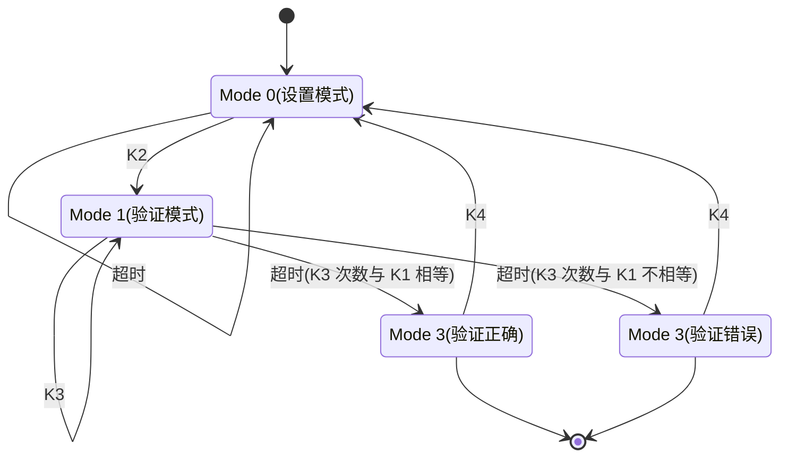
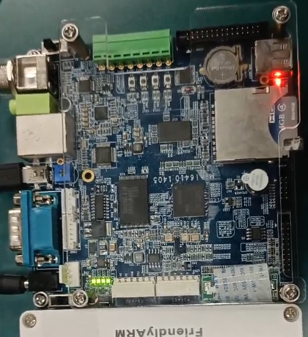
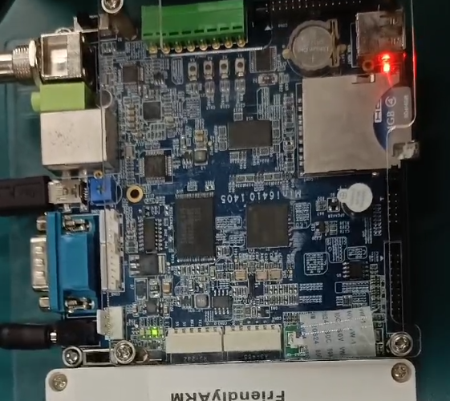

## 一、设计题目及要求
### 题目
【课题5】单个按键次数识别与判断  

### 设计要求
判断按键按下次数与 LED 灯点亮次数是否一致，根据判断结果显示。  
1. 以 K1 连续按下的次数作为初始参数，设置完成后使用蜂鸣器鸣叫 1 次作为确认。  
2. K2 按下时，四个 LED 灯（LED1 ~LED4）以 1 秒（定时器中断实现）的间隔同时闪烁 K1 按下的次数，然后熄灭。  
3. 此时，若 K3 按下的次数等于 LED 的闪烁次数，则四个 LED 灯按 0.5 秒（定时器中断实现）的间隔首先从 LED1 到 LED4 逐一点亮，然后从 LED4 到 LED1 逐一点亮（同一个时刻只有一个灯亮），并循环显示；若不相等，则四个 LED 灯按 0.5 秒（定时器中断实现）的间隔同时闪烁，且蜂鸣器以相同的频率鸣叫。  
4. K4 按下时，所有 LED 灯熄灭，蜂鸣器停止鸣叫，系统进入初始状态。  
- 说明：若采用查询方式判断按键是否按下，在程序中注意对按键的实时响应处理（即任意一个按键按下后，程序能立即执行对应的功能操作），同时需要对按键进行软件消抖。连续按键的间隔时间自行确定，合理即可。LED 灯亮 1 次+灭 1 次视为闪烁 1 次。蜂鸣器通过 GPF14 作为输出口进行控制，输出高电平鸣叫，输出低电平关闭。未特别要求定时器中断实现的时间间隔，均可通过软件延时实现。  

## 二、设计思想
- 程序状态切换基于自动机实现。（详见 [三、功能流程图](#三、功能流程图)）  
- 按键消抖基于积分与锁标志实现，在每个主循环周期内，若物理按键按下则积分结果加 1，否则减 1，当积分结果达到阈值且锁标志未锁定时，则设置触发标志并锁定锁标志，当积分结果回落为 0 时，解锁锁标志。代码如下：  
```c
#define KEY_CHECK(n)                                                                                     \
	do                                                                                                   \
	{                                                                                                    \
		if (get_KEY(n)) /* 按键按下 */                                                               \
		{                                                                                                \
			if (key_loop[n] <= KEY_LOOP_NUM) /* 计数未到上限 */                                    \
			{                                                                                            \
				key_loop[n]++; /* 计数增长 */                                                        \
			}                                                                                            \
			if (key_loop[n] == KEY_LOOP_NUM && key_lock[n] == 0) /* 计数到上限且按键未锁定 */ \
			{                                                                                            \
				key_pressed[n] = 1; /* 触发 */                                                         \
				key_lock[n] = 1;	/* 锁定按键 */                                                   \
			}                                                                                            \
		}                                                                                                \
		else /* 按键松开 */                                                                          \
		{                                                                                                \
			if (key_loop[n] > 0) /* 计数未到下限 */                                                \
			{                                                                                            \
				key_loop[n]--; /* 计数减少 */                                                        \
			}                                                                                            \
			if (key_loop[n] == 0) /* 计数到下限 */                                                  \
			{                                                                                            \
				key_lock[n] = 0; /* 解锁按键 */                                                      \
			}                                                                                            \
		}                                                                                                \
	} while (0)
```

## 三、功能流程图


## 四、结果讨论



## 附录：实验代码
main.c
```c
#define GPNCON (*(volatile unsigned long *)0x7F008830)
#define GPNDAT (*(volatile unsigned long *)0x7F008834)
#define GPKCON0 (*((volatile unsigned long *)0x7F008800))
#define GPKDATA (*((volatile unsigned long *)0x7F008808))
#define EINT0CON0 (*((volatile unsigned long *)0x7F008900))
#define EINT0MASK (*((volatile unsigned long *)0x7F008920))
#define EINT0PEND (*((volatile unsigned long *)0x7F008924))
#define PRIORITY (*((volatile unsigned long *)0x7F008280))
#define SERVICE (*((volatile unsigned long *)0x7F008284))
#define SERVICEPEND (*((volatile unsigned long *)0x7F008288))
#define VIC0IRQSTATUS (*((volatile unsigned long *)0x71200000))
#define VIC0FIQSTATUS (*((volatile unsigned long *)0x71200004))
#define VIC0RAWINTR (*((volatile unsigned long *)0x71200008))
#define VIC0INTSELECT (*((volatile unsigned long *)0x7120000c))
#define VIC0INTENABLE (*((volatile unsigned long *)0x71200010))
#define VIC0INTENCLEAR (*((volatile unsigned long *)0x71200014))
#define VIC0PROTECTION (*((volatile unsigned long *)0x71200020))
#define VIC0SWPRIORITYMASK (*((volatile unsigned long *)0x71200024))
#define VIC0PRIORITYDAISY (*((volatile unsigned long *)0x71200028))
#define VIC0ADDRESS (*((volatile unsigned long *)0x71200f00))
#define PWMTIMER_BASE (0x7F006000)
#define TCFG0 (*((volatile unsigned long *)(PWMTIMER_BASE + 0x00)))
#define TCFG1 (*((volatile unsigned long *)(PWMTIMER_BASE + 0x04)))
#define TCON (*((volatile unsigned long *)(PWMTIMER_BASE + 0x08)))
#define TCNTB0 (*((volatile unsigned long *)(PWMTIMER_BASE + 0x0C)))
#define TCMPB0 (*((volatile unsigned long *)(PWMTIMER_BASE + 0x10)))
#define TCNTO0 (*((volatile unsigned long *)(PWMTIMER_BASE + 0x14)))
#define TCNTB1 (*((volatile unsigned long *)(PWMTIMER_BASE + 0x18)))
#define TCMPB1 (*((volatile unsigned long *)(PWMTIMER_BASE + 0x1C)))
#define TCNTO1 (*((volatile unsigned long *)(PWMTIMER_BASE + 0x20)))
#define TCNTB2 (*((volatile unsigned long *)(PWMTIMER_BASE + 0x24)))
#define TCMPB2 (*((volatile unsigned long *)(PWMTIMER_BASE + 0x28)))
#define TCNTO2 (*((volatile unsigned long *)(PWMTIMER_BASE + 0x2C)))
#define TCNTB3 (*((volatile unsigned long *)(PWMTIMER_BASE + 0x30)))
#define TCMPB3 (*((volatile unsigned long *)(PWMTIMER_BASE + 0x34)))
#define TCNTO3 (*((volatile unsigned long *)(PWMTIMER_BASE + 0x38)))
#define TCNTB4 (*((volatile unsigned long *)(PWMTIMER_BASE + 0x3C)))
#define TCNTO4 (*((volatile unsigned long *)(PWMTIMER_BASE + 0x40)))
#define TINT_CSTAT (*((volatile unsigned long *)(PWMTIMER_BASE + 0x44)))
#define GPFCON (*(volatile unsigned int *)0x7F0080A0)
#define GPFDAT (*(volatile unsigned int *)0x7F0080A4)

typedef void(isr)(void);
extern void asm_timer_irq();

void buzzer_init(void) // 蜂鸣器初始化
{
	// set GPF14 as output
	GPFCON |= 1 << 28;
	GPFCON &= ~(1 << 29);
}
void irq_init(void) // 中断初始化
{
	/* 在中断控制器里使能timer0中断 */
	VIC0INTENABLE |= (1 << 23);
	VIC0INTSELECT = 0;
	isr **isr_array = (isr **)(0x7120015C);
	isr_array[0] = (isr *)asm_timer_irq;
	/*将GPK4-GPK7配置为输出口*/
	GPKCON0 = 0x11110000;
	/*熄灭四个LED灯*/
	GPKDATA = 0xff;
}
// 初始化timer
void timer_init(int flag, unsigned long utimer, unsigned long uprescaler, unsigned long udivider, unsigned long utcntb, unsigned long utcmpb)
{
	unsigned long temp0;
	// 定时器的输入时钟 = PCLK / ( {prescaler value + 1} ) / {divider value} = PCLK/(65+1)/16=62500hz
	// 设置预分频系数为66
	temp0 = TCFG0;
	temp0 = (temp0 & (~(0xff00ff))) | (uprescaler << 0);
	TCFG0 = temp0;
	// 16分频
	temp0 = TCFG1;
	temp0 = (temp0 & (~(0xf << 4 * utimer)) & (~(1 << 20))) | (udivider << 4 * utimer);
	TCFG1 = temp0;
	// 1s = 62500hz
	TCNTB0 = utcntb;
	TCMPB0 = utcmpb;
	// 手动更新
	TCON |= 1 << 1;
	// 清手动更新位
	TCON &= ~(1 << 1);
	// 自动加载和启动timer0
	TCON |= (1 << 0) | (1 << 3);
	// 使能timer0中断
	temp0 = TINT_CSTAT;
	temp0 = (temp0 & (~(1 << utimer))) | (1 << (utimer));
	TINT_CSTAT = temp0;
}

static int LED_state_flag = 5;	// 灯定时器的模式
static int LED_blink_count = 0; // 定时器LED闪烁次数
static int LED_flow_count = 0;	// 流水灯步数
static int global_mode = 0;		// 当前模式
static int count1 = 0;			// K1次数
static int count2 = 0;			// K3次数

const volatile int led[] = {0xe0, 0xd0, 0xb0, 0x70, 0x70, 0xb0, 0xd0, 0xe0}; // 四个灯的亮暗设置

void buzzer_on() // 蜂鸣器开
{
	GPFDAT |= 1 << 14;
}
void buzzer_off() // 蜂鸣器关
{
	GPFDAT &= ~(1 << 14);
}

void set_LED(int state)
{
	switch (state)
	{
	case -2:
	{
		GPKDATA = 0xff; // 全灭
		break;
	}
	case -1:
	{
		GPKDATA = 0x00; // 全亮
		break;
	}
	default:
	{
		if (state >= 0 && state <= 7)
		{
			GPKDATA = led[state]; // 流水灯
		}
		break;
	}
	}
}

int get_LED(int state)
{
	switch (state)
	{
	case -2:
	{
		return GPKDATA == 0xff; // 全灭
	}
	case -1:
	{
		return GPKDATA == 0x00; // 全亮
	}
	default:
	{
		if (state >= 0 && state <= 7)
		{
			return GPKDATA == led[state]; // 流水灯
		}
		break;
	}
	}

	return 0;
}

int get_KEY(int id)
{
	return (GPNDAT & (1 << id)) == 0;
}

void delayxms(volatile long i) // 延时函数（volatile防止代码被优化，强制执行i次）
{
	while (i--)
		;
}

// timer0中断的中断处理函数
void do_irq()
{
	unsigned long uTmp;
	// 清timer0的中断状态寄存器
	uTmp = TINT_CSTAT;
	TINT_CSTAT = uTmp;
	VIC0ADDRESS = 0x0;

	switch (LED_state_flag)
	{
	case 1: // 状态1 闪烁按键按下次数
	{
		if (LED_blink_count > 0)
		{
			LED_blink_count--;

			// 闪烁
			if (LED_blink_count % 2 == 0)
			{
				set_LED(-2);
			}
			else
			{
				set_LED(-1);
			}
		}

		break;
	}
	case 2: // 状态2 流水灯
	{
		set_LED(LED_flow_count++);

		if (LED_flow_count == 8) // 重新开始
			LED_flow_count = 0;

		break;
	}
	case 3: // 状态3 全亮
	{
		set_LED(-1); // 全亮
		break;
	}
	case 4: // 状态4 闪烁蜂鸣
	{
		// 灯的状态取反
		if (get_LED(-1))
		{
			set_LED(-2);
		}
		else
		{
			set_LED(-1);
		}

		// 蜂鸣器跟随灯的状态
		if (get_LED(-1))
			buzzer_on();
		else
			buzzer_off();

		break;
	}
	case 5: // 状态5 全灭
	{
		set_LED(-2); // 全灭
	}
	}
}

#define KEY_LOOP_NUM 5		// 按键防抖量
#define KEY_TIMEOUT_NUM 150 // 按键确认延时
#define BUZZER_LOOP_NUM 30	// 蜂鸣器确认提示时长

#define KEY_CHECK(n)                                                                                     \
	do                                                                                                   \
	{                                                                                                    \
		if (get_KEY(n)) /* 按键按下 */                                                               \
		{                                                                                                \
			if (key_loop[n] <= KEY_LOOP_NUM) /* 计数未到上限 */                                    \
			{                                                                                            \
				key_loop[n]++; /* 计数增长 */                                                        \
			}                                                                                            \
			if (key_loop[n] == KEY_LOOP_NUM && key_lock[n] == 0) /* 计数到上限且按键未锁定 */ \
			{                                                                                            \
				key_pressed[n] = 1; /* 触发 */                                                         \
				key_lock[n] = 1;	/* 锁定按键 */                                                   \
			}                                                                                            \
		}                                                                                                \
		else /* 按键松开 */                                                                          \
		{                                                                                                \
			if (key_loop[n] > 0) /* 计数未到下限 */                                                \
			{                                                                                            \
				key_loop[n]--; /* 计数减少 */                                                        \
			}                                                                                            \
			if (key_loop[n] == 0) /* 计数到下限 */                                                  \
			{                                                                                            \
				key_lock[n] = 0; /* 解锁按键 */                                                      \
			}                                                                                            \
		}                                                                                                \
	} while (0)

int main()
{
	buzzer_init();

	static int key_loop[4] = {0, 0, 0, 0};
	static int key_lock[4] = {0, 0, 0, 0};
	static int BUZZER_blink_count = 0; // 蜂鸣计数
	static int BUZZER_blink_times = 0; // 蜂鸣次数
	static int KEY_timeout_count = 0;  // 按键计数超时计数
	static int KEY_timeout_lock = 1;   // 按键计数锁定

	while (1)
	{
		// 防抖判断按键触发
		int key_pressed[4] = {0, 0, 0, 0};
		KEY_CHECK(0);
		KEY_CHECK(1);
		KEY_CHECK(2);
		KEY_CHECK(3);

		// 蜂鸣器有限次数鸣响计数
		if (BUZZER_blink_count > 0)
		{
			BUZZER_blink_count--; // 蜂鸣器动作延时计数减少
			if (BUZZER_blink_count == 0) // 延时结束
			{
				// 蜂鸣器剩余动作次数
				if (BUZZER_blink_times > 0)
				{
					BUZZER_blink_times--; //蜂鸣器剩余动作次数减少

					// 蜂鸣器动作
					if (BUZZER_blink_times % 2 == 1)
					{
						buzzer_on();
					}
					else
					{
						buzzer_off();
					}

					if (BUZZER_blink_times == 0)
					{
						// 蜂鸣结束
					}
					else
					{
						// 蜂鸣未结束，开始下一轮动作延时
						BUZZER_blink_count = BUZZER_LOOP_NUM;
					}
				}
			}
		}

		// 按键计数延时
		if (KEY_timeout_count > 0)
		{
			KEY_timeout_count--;
			if (KEY_timeout_count == 0) // 按键超时
			{
				// 锁定
				KEY_timeout_lock = 1;

				if (global_mode == 0) // 结束次数设置
				{
					// 蜂鸣1次
					BUZZER_blink_times = 1 * 2;
					BUZZER_blink_count = BUZZER_LOOP_NUM;
				}
				else if (global_mode == 1) // 结束次数验证
				{
					if (count2 == count1) // 正确
					{
						// 关蜂鸣器和LED
						set_LED(-2);
						buzzer_off();

						// LED流水灯模式
						LED_flow_count = 0;
						LED_state_flag = 2;
						timer_init(0, 0, 65, 4, 31250, 0); // 0.5秒定时器
					}
					else // 错误
					{
						// 关蜂鸣器和LED
						set_LED(-2);
						buzzer_off();

						// 闪烁蜂鸣模式
						LED_state_flag = 4;
						timer_init(0, 0, 65, 4, 31250, 0); // 0.5秒定时器
					}

					// 进入结束模式
					global_mode = 3;
				}
			}
		}

		if (key_pressed[0] && global_mode == 0) // 按键1增加计数
		{
			// 解锁并重置计数
			if (KEY_timeout_lock)
			{
				count1 = 0;
				KEY_timeout_lock = 0;
			}

			// 计数增加
			count1++;

			// 延时后结束计数
			KEY_timeout_count = KEY_TIMEOUT_NUM;
		}
		if (key_pressed[1] && global_mode == 0) // 按键2切换模式
		{
			if (KEY_timeout_lock) // 计数过程中不可切换模式
			{
				// 关蜂鸣器和LED
				LED_state_flag = 5;
				set_LED(-2);
				buzzer_off();

				// 进入检验模式
				KEY_timeout_count = 0;		  // 取消未鸣响的计数结束提示
				LED_blink_count = count1 * 2; // 闪烁次数 = count1
				LED_state_flag = 1;			  // 四个全部闪烁
				global_mode = 1;			  // 进入检验模式
				timer_init(0, 0, 65, 4, 62500, 0); // 1秒定时器
			}
		}
		if (key_pressed[2] && global_mode == 1) // 按键3验证计数
		{
			// 解锁并重置计数
			if (KEY_timeout_lock)
			{
				count2 = 0;
				KEY_timeout_lock = 0;

				// 关蜂鸣器和LED
				LED_state_flag = 5;
				set_LED(-2);
				buzzer_off();
			}

			// 计数增加
			count2++;

			// 延时后结束计数
			KEY_timeout_count = KEY_TIMEOUT_NUM;
		}
		if (key_pressed[3]) // 按键4回归初始状态
		{
			// 关蜂鸣器和LED
			LED_state_flag = 5;
			set_LED(-2);
			buzzer_off();

			// 设置回初始状态
			global_mode = 0;
			LED_blink_count = 0;
			LED_flow_count = 0;
			BUZZER_blink_count = 0;
			BUZZER_blink_times = 0;
			KEY_timeout_count = 0;
			KEY_timeout_lock = 1;
			count1 = 0;
			count2 = 0;
		}

		// 循环延迟
		delayxms(50000);
	}

	return 0;
}
```
start.S
```armasm
.globl _start
.global asm_timer_irq
.extern do_irq
_start:

reset:
	// 外设地址告诉cpu
    ldr r0, =0x70000000
    orr r0, r0, #0x13
    mcr p15,0,r0,c15,c2,4
    
	// 关看门狗
	ldr r0, =0x7E004000
	mov r1, #0
	str r1, [r0]
	
	//Enabel VIC
	mrc p15,0,r0,c1,c0,0
	orr r0,r0,#(1<<24)
	mcr p15,0,r0,c1,c0,0	

	// 设置栈
	ldr sp, =8*1024

	// 初始化时钟
	bl clock_init

	// 初始化ddr
	bl sdram_init

	// 初始化nandflash
	bl nand_init

	// 初始化中断
	bl irq_init
	
	// 开中断
	//mov r0, #0x53
	//msr CPSR_cxsf, r0
	mrs r0,cpsr
	bic r0,r0,#0x80
	msr cpsr_c,r0

	// 重定位，把程序的代码段、数据段复制到它的链接地址去
	adr r0, _start   		
	ldr r1, =_start  		
	ldr r2, =bss_start      	
	sub r2, r2, r1
	cmp r0,r1
	beq clean_bss
	bl copy2ddr					
	cmp r0, #0
	bne halt

	// 清BSS，把BSS段对应的内存清零
clean_bss:
	ldr r0, =bss_start
	ldr r1, =bss_end
	mov r3, #0
	cmp r0, r1
	beq on_ddr
clean_loop:
	str r3, [r0], #4
	cmp r0, r1
	bne clean_loop

on_ddr:
	// 跳转
	ldr pc, =main

	// 中断异常
asm_timer_irq:
	.word irq
irq:
	/* 1. 保存现场 */
	ldr sp, =0x54000000
	sub lr, lr, #4
	stmfd sp!, {r0-r12, lr}  /* lr就是swi的下一条指令地址 */
	/* 2. 处理异常 */
	bl do_irq
	/* 3. 恢复现场 */
	ldmfd sp!, {r0-r12, pc}^  /* ^表示把spsr恢复到cpsr */

halt:
	b halt
```
其余代码见 <https://github.com/FangCunWuChang/Button-LED-Buzzer>  
